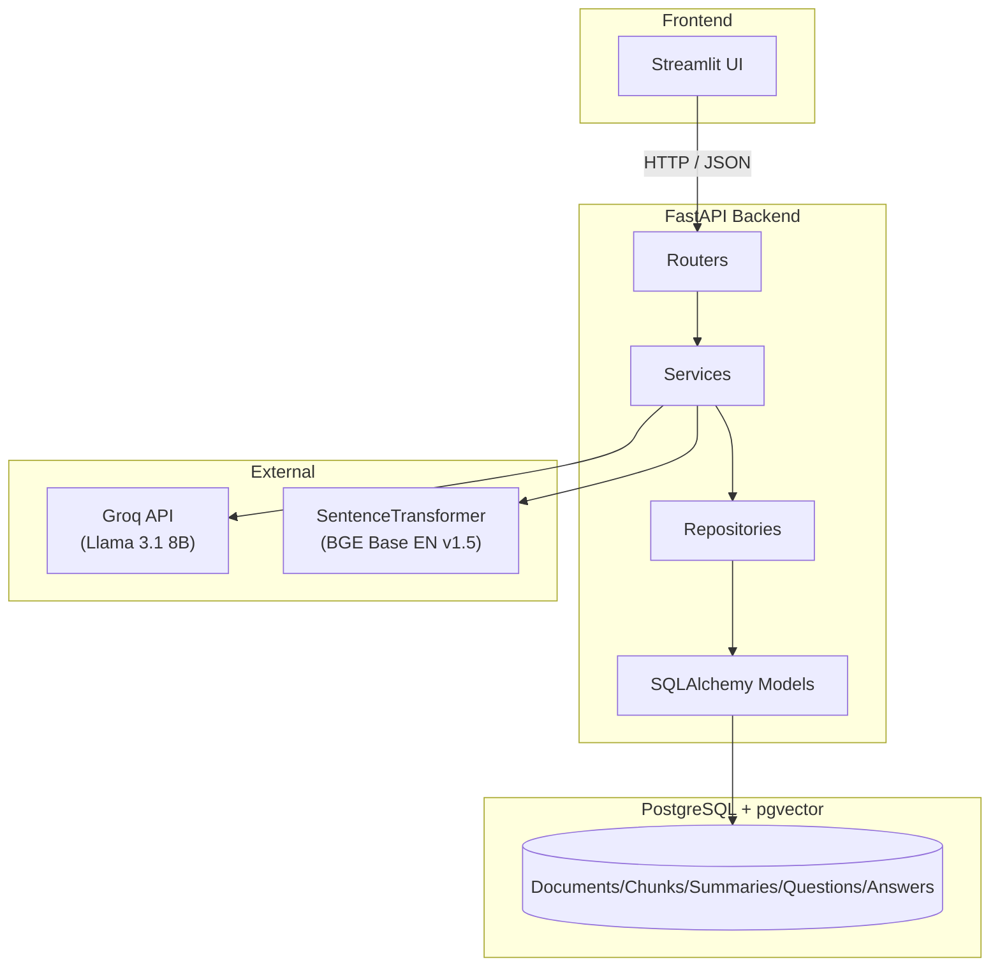
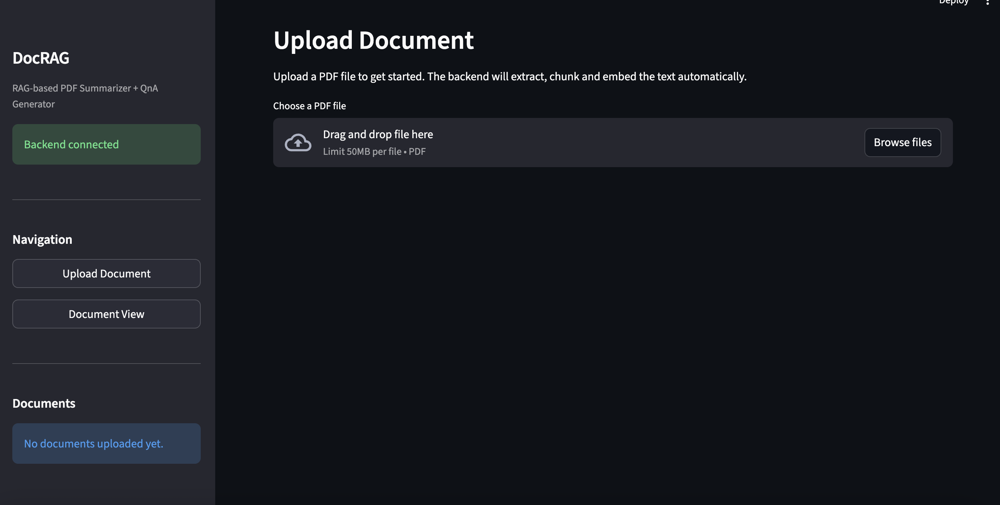
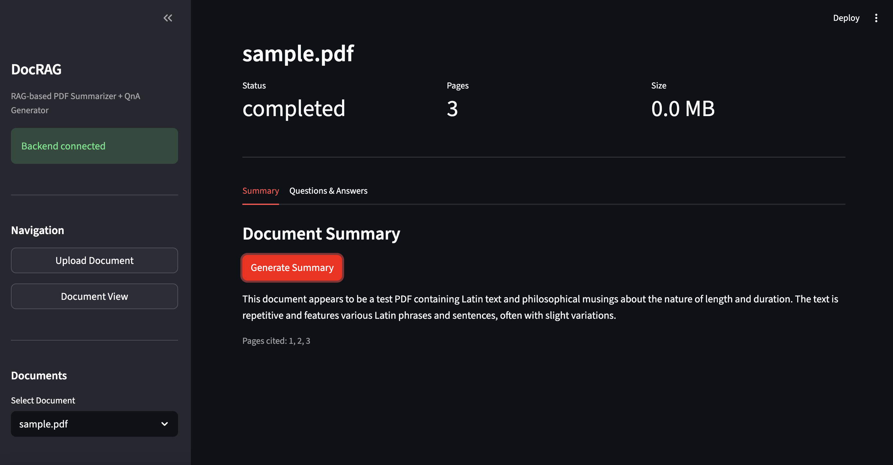
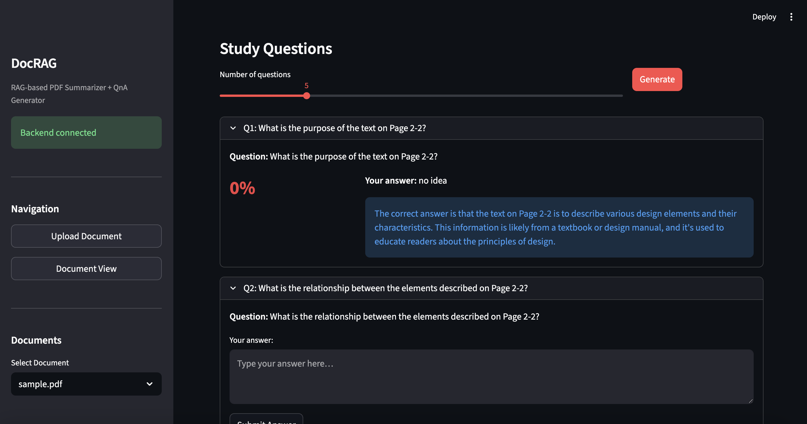

# DocRAG

**A RAG system for PDF summarization, and study Q&A generation**

DocRAG is a full-stack AI application that demonstrates Retrieval-Augmented Generation (RAG) with clean backend architecture, vector search, and LLM integration. Upload any PDF and the system will extract, chunk, and embed the content. It will then use it to generate summaries with page citations, study questions, and AI-graded answers.

---

## Features

- **PDF Upload and Processing** 
Upload PDF documents with automatic text extraction, cleanup, chunking, and embedding generation, all handled as a background job with real-time status tracking.

- **AI-Powered Summarization** 
Generate concise document summaries from the most relevant chunks, with page citations linking each point back to the source material.

- **Study Question Generation** 
Automatically produce study questions from document content with similarity-based deduplication to ensure variety.

- **Answer Evaluation** 
Submit answers to generated questions and receive AI-powered scoring and feedback using an LLM judge.

- **Document Chat** 
Ask free-form questions about your document and receive answers grounded in the most relevant passages via similarity search.

- **Background Processing with Status Tracking** 
Long-running operations (extraction, chunking, embedding) run asynchronously with persistent status updates (`uploaded` -> `processing` -> `completed` / `failed`).

---

## Architecture



### Internal Layers

| Layer | Responsibility |
|---|---|
| **Routers** | HTTP endpoints, request validation, dependency injection |
| **Services** | Business logic: PDF extraction, chunking, embedding, LLM calls, retrieval |
| **Repositories** | Database access: CRUD operations, similarity search queries |
| **Models** | SQLAlchemy ORM models with pgvector column types |

---

## Tech Stack

| Layer | Technology |
|---|---|
| Backend | Python 3.11, FastAPI, Uvicorn |
| LLM | Llama 3.1 8B via Groq API |
| Embeddings | BAAI/bge-base-en-v1.5 (SentenceTransformers, local) |
| Database | PostgreSQL 17 + pgvector |
| PDF Processing | PyMuPDF |
| Chunking | LangChain RecursiveCharacterTextSplitter |
| Frontend | Streamlit |
| Configuration | pydantic-settings |
| Migrations | Alembic |
| Deployment | Render (backend + DB), Streamlit Community Cloud (frontend) |
| Tooling | Poetry, Docker, pytest, ruff |

---

## API Endpoints

All endpoints are under the `/api` prefix.

| Method | Endpoint | Description |
|---|---|---|
| `GET` | `/health` | Health check |
| `GET` | `/api/documents/` | List all uploaded documents |
| `POST` | `/api/documents/` | Upload a PDF and start background processing |
| `GET` | `/api/documents/{id}/status` | Get document processing status |
| `POST` | `/api/documents/{id}/search` | Similarity search within a document |
| `GET` | `/api/documents/{id}/summary` | Retrieve existing summary |
| `POST` | `/api/documents/{id}/summarize` | Generate a new summary |
| `GET` | `/api/documents/{id}/questions` | List generated questions |
| `POST` | `/api/documents/{id}/questions` | Generate study questions |
| `GET` | `/api/documents/{id}/questions/{qid}/answer` | Get answer evaluation |
| `POST` | `/api/documents/{id}/questions/{qid}/answer` | Submit and evaluate an answer |

---

## Screenshots

### Upload & Processing


### AI Summarization


### Question Generation & Answer Evaluation


---

## Getting Started

### Prerequisites

- Python 3.11+
- [Poetry](https://python-poetry.org/) 2.x
- [Docker](https://www.docker.com/) and Docker Compose
- A [Groq API key](https://console.groq.com/) (free tier available)

### Setup

```bash
# Clone the repository
git clone https://github.com/deettoh/doc-rag.git
cd doc-rag

# Install dependencies
poetry install

# Copy environment file and add your Groq API key
cp .env.example .env
# Edit .env and set GROQ_API_KEY=your_key_here
```

### Run with Docker Compose

```bash
docker compose up --build
```

This starts three services:

| Service | URL |
|---|---|
| FastAPI Backend | http://localhost:8000 |
| Swagger Docs | http://localhost:8000/docs |
| Streamlit Frontend | http://localhost:8501 |

### Run Tests

```bash
poetry run pytest
```

### Lint and Format

```bash
poetry run ruff check .
poetry run ruff format --check .
```

---

## Project Structure

```
doc-rag/
├── src/app/
│   ├── main.py                    # FastAPI app entrypoint
│   ├── config.py                  # pydantic-settings configuration
│   ├── db.py                      # Database session management
│   ├── middleware.py              # Request ID logging middleware
│   ├── exception_handlers.py      # Centralized error handling
│   ├── exceptions.py              # Custom exception classes
│   ├── models/                    # SQLAlchemy ORM models
│   │   ├── document.py
│   │   ├── chunk.py
│   │   ├── summary.py
│   │   ├── question.py
│   │   └── answer.py
│   ├── repositories/              # Database access layer
│   ├── routers/                   # API endpoint definitions
│   │   └── documents.py           # Main document API endpoints
│   ├── schemas/                   # Pydantic request/response models
│   └── services/                  # Business logic
│       ├── pdf_extractor.py       # PDF text extraction + cleanup
│       ├── chunking.py            # Text chunking with metadata
│       ├── embedding.py           # SentenceTransformer embeddings
│       ├── retrieval.py           # Similarity search
│       ├── llm.py                 # Groq API wrapper
│       ├── summarization.py       # Summary generation
│       ├── question_generation.py # Automated study question generation
│       ├── answer_evaluation.py   # AI-powered grading and feedback
│       ├── processing.py          # Background job orchestration
│       └── storage.py             # File storage management
├── frontend/
│   └── app.py                     # Streamlit frontend
├── tests/                         # Unit, integration, and E2E tests
├── docker-compose.yml             # Local development orchestration
├── Dockerfile.backend             # Backend container definition
└── Dockerfile.frontend            # Frontend container definition
```